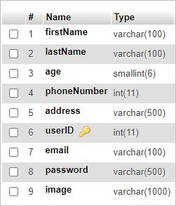

# React-NodeJs-Login-Sign-Up
Login/Sign-Up using React, Redux, NodeJs and Express

Please perform following steps as explained and in sequence

1. Clone the repository from github.
2. Install XAMPP. Run the downloaded exe. Start MySQL and Apache.
3. In browser open http://localhost/phpmyadmin
4. Create a database sampleDB.
5. Create a table userInfo with following schema:

6. Now we have set up our databse.
7. Open the repository in VS Code.
8. Open frontend folder in terminal. Run following commands in given sequence.  
  i. npm i  
  ii. npm run build  
  iii. npm run start   
9. Now open http://localhost:8080/login in the browser. You will be able to see the login page with Sign Up option.
10. Open backend in separate terminal and run npm i.
11. To run the backend, open backend\routes in terminal and just run **node script.js**  
Give it at lease 2 minutes to start properly otherwise you will see 404 on frontend if you try to login.  
**Do not do npm build or npm start in backend**
12. Now we can go back to http://localhost:8080/login and register by signing up.
13. You will be redirected to login page after registering.
14. Login using credentials. Your profile page will open.
15. Profile page has 2 options.  
  i. Edit - You will be redirected to edit page. On saving edited info, you will be redirected back to profile which will display newly added info.  
  ii. Log Out - On logging out, you will be redirected to login page.  
 
